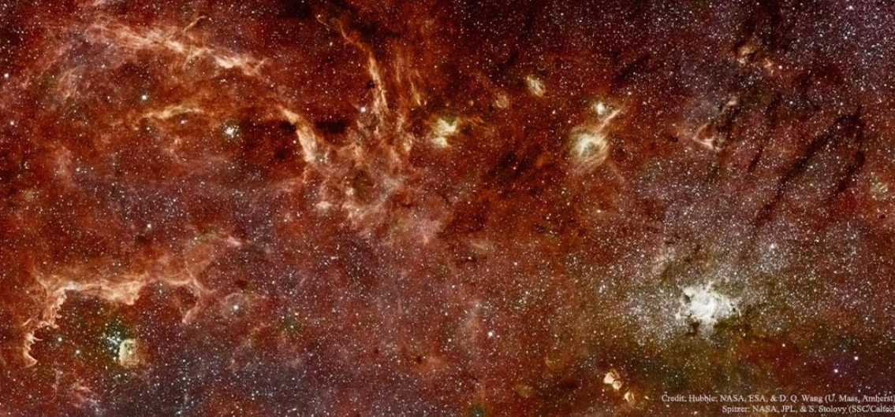

# NASA-APOD-Chrome-Extension
Here I have made use of one of the most popular websites at NASA that is the Astronomy Picture of the Day. In fact, this website is one of the most popular websites across all federal agencies. It has the popular appeal of a Justin Bieber video. This endpoint structures the APOD imagery and associated metadata so that it can be repurposed for other applications. In addition, if the concept_tags parameter is set to True, then keywords derived from the image explanation are returned. These keywords could be used as auto-generated hashtags for twitter or instagram feeds; but generally help with discoverability of relevant imagery.

P.S. I have not published it, since 5 Dollars were required :D

<h1>About the API</h1>

The full documentation for this API can be found in the <a href="https://github.com/nasa/apod-api">APOD API Github repository.
  
<h2>HTTP Request</h2>
GET https://api.nasa.gov/planetary/apod   

concept_tags are now disabled in this service. Also, an optional return parameter copyright is returned if the image is not public domain.  
  
 
<h2>Example Imagery</h2>

<h2>Query Parameters</h2>
Parameter	Type	Default	Description
date	YYYY-MM-DD	today	The date of the APOD image to retrieve
start_date	YYYY-MM-DD	none	The start of a date range, when requesting date for a range of dates. Cannot be used with date.
end_date	YYYY-MM-DD	today	The end of the date range, when used with start_date.
count	int	none	If this is specified then count randomly chosen images will be returned. Cannot be used with date or start_date and end_date.
thumbs	bool	False	Return the URL of video thumbnail. If an APOD is not a video, this parameter is ignored.
api_key	string	DEMO_KEY	api.nasa.gov key for expanded usage
  

<h2>Example Query</h2>
https://api.nasa.gov/planetary/apod?api_key=DEMO_KEY

Use your own API_KEY!
